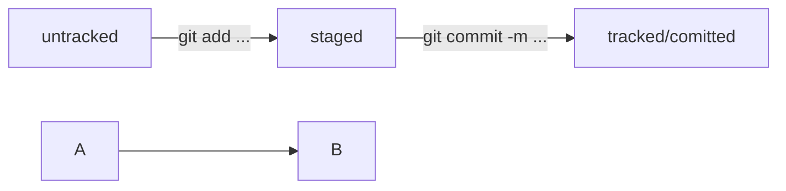

# Пошаговая инструкция для работы с Git

## Для установки Git на операционные системы GNU/Linux:
- воспользуйтесь терминалом, во всех дистрибутивах семейства GNU/Linux, Git доступен при установке из консоли с помошью стандартного пакетного менеджера;
  конкретные комманды зависят от дистрибутива и используемого пакетного менеджера.
  Рекомендуется для устанавки использовать стандарный пакетный менеджер. В качестве примера будет продемонстрированна команда для терминала ОС семей GNU/Linux Fedora:
``` 
sudo dnf install git 
```
- когда установка завершится, для проверки выполните эту команду:
``` 
git version
```
- если вы видите в консоли текущую версию Git, всё прошло успешно;
- команды для настройки
``` 
git config --global user.name "User Namovich
``` 
### имя или ник нужно написать латиницей и в кавычках

``` 
git config --global user.email username@yandex.ru
```
### здесь нужно указать свой настоящий email
 ## _____________________________________________________________________
# Команды для работы
## Для инициализации
``` 
git init 
```
### инициализирует инструмент git и создает в директории файл .git - который хранит все изминения
## Для отслеживания изминений 
``` 
git add . 
```
### команда добавит в отслеживаемые все файлы и папки в текущей директории
``` 
git add all 
```
### аналог команды git add .
``` 
git add "name" 
```
### добавляет в отслеживаемые только указаные по имени файлы и/или папки


## ----------------------------------------------------------------------------------------
# Команды для "отката" состояния файлов (area) 
```
git restore --staged "name"
```
### переводит указанный файл из зоны staged в untracked 
```
git reset --hard <commit hash>
```
### сбросить изминения
```
git restore <file name>
```
### «Откатить» изменения, которые не попали ни в staging, ни в коммит


## ---------------------------------------------------------------------------------------------------------
## Команды объединяющие последний "коммит"
```
git commit --amend --no-edit
```
### добавляет файлы к предыдущему коммиту из зоны staged
```
git commit --amend -m "AMEND MESSAGE"
```
### позволяет изменить сообщение последнего коммита


## Команды отображающие взаимодествие Git и пользователя
``` 
git status 
```
### показывает текущее состояние репозитория
``` 
git log 
```
### показывает кто и когда комитил
```
git log --oneline
```
### выдает результат в одну строку (7 символов хэша) + текс (кто и когда комитил)
# _____________________________DIFF_____________
```
git diff
```
## показывает изменения, которые не были добавлены в staged
```
git diff --staged
```
## показывает, что изменилось в проиндексированных файлах
```
git diff a9928ab 11bada1
```
### покажет различия коммитов с хешами a9928ab и 11bada1
```
@@ -1,10 +1,10 @@.
```
### В вывод команды попало по 10 строк из обеих версий файла, начиная с первой. Об этом говорит выражение @@ -1,10 +1,10 @@.
## -----------------------
## Для облегчения этой задачи в Git есть суффикс навигации ~N, где N — это число. Он отсчитывает от заданного коммита N коммитов назад во времени. 
## Нумерация начинается с нуля: 
```
commit~0 — это сам коммит, commit~1 — предыдущий, commit~2 — предшествующий предыдущему и так далее.
```
```
git diff HEAD~ HEAD 
```
### Выводит разницу между предыдущим и текущим коммитами

## ----------------------------------------------------------------------------------------------------------
# Команды для работы с ветками
```
git branch
```
## отображает какие ветки созданы а также текущую
```
git branch <название_ветки>
```
### команда для создания веток
```
git branch -m main 
```
### команда для именования ветки, в данном случае имя ветки будет "main"
```
git checkout <name_branch>
```
### сменить ветку
```
git checkout -b <name_branch>
```
### создать новую ветку и сразу перейти в нее
```
git branch -a
```
### отобразить все ветки в том числе GitHub

## ____________________________________________________________________________________________________________

## Команды для сохранения состояния репозитория
```
git commit -m "first commit"
```
### команды сохраняет состояние репозитория, "комитит"
```
git push
```
### команда позволяет сохранить удаленный репозиторий (если есть привязка к платформе GitHub и настроены SSH-ключи), "пушит"
```
git push -f
```
### пушит игнорируя препядствия
## ----------------------------------------------------------------------------------------------------

# Команды для управления удаленным репозиторием
```
git push -u origin sprint_7-solution-in-file-manager
```
## Добавляем новую ветку из гита на ГитХаб
```
git remote add origin git@github.com:OWNER/REPOSITORY.git
```
## Добавление удаленного репозитория через SSH 
```
git remote add origin https://github.com/OWNER/REPOSITORY.git
```
## Добавление удаленного репозитория через https
```
git remote set-url origin https://github.com/OWNER/REPOSITORY.git
```
## Переключение удаленных URL-адресов с SSH на HTTPS
```
git remote set-url origin git@github.com:OWNER/REPOSITORY.git
```
## Переключение удаленных URL-адресов с HTTPS на SSH
```
git remote -v
```
## отобразить связь с удаленным репозиторием
```
git remote rm origin
```
## эта команда удалит текущий origin
```
git remote add origin git@github.com:%ВАШ_АККАУНТ%/github-case.git
```
## добавляет новую связь с удаленным репозиторием, после удаления предыдущей связи!

### ----------------------------------------------------------------------------------------------------

## HEAD
### Это файл в папке .git, в котором записана ссылка (или ссылка на ссылку) на последний коммит.
### Это синоним хеша последнего коммита — его можно передавать командам Git в качестве параметра. 

### ----------------------------------------------------------------------------------------------------

## Статусы Git:
### untracked (англ. «неотслеживаемый»)
### untracked + git add = staged
### modified + git add = staged
### staged + git commit = tracked



# .gitignore
## игнорировать все файлы в каталоге build
```
build/
```
## игнорировать все .log файлы
```
*.log
```
## не игнорировать *.log файлы в examples
## потому что это пример для документации
```
!examples/**/*.log 
```
# ____MERGE__and__Delete__________
```
git merge <name_branch>
```
### объединить текущую ветку с указанной
```
git branch -D <название_ветки>
```
### удалить указанную ветку после слияния с текущей
```
git branch -d %имя_ветки%
```
### удалит ветку только если она была полностью объединена с другой

# Можно создать локальные версии всех веток c помощью команды git checkout ...

# ______PULL_____
```
git pull
```
### Команда для скачивания изменений из удалённого репозитория
